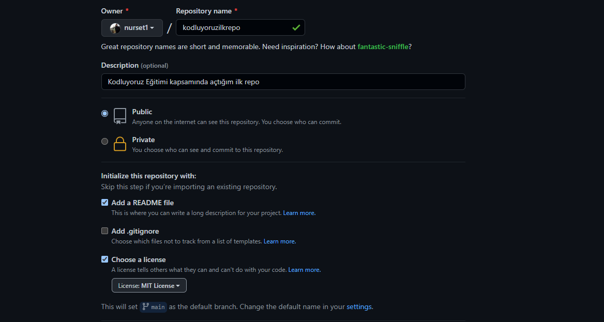

# Kodluyoruz İlk Repo
Bu repo Kodluyoruz Front-End Eğitiminde oluşturduğumuz ilk repo. İçerisinde bir ader README dosyası, bir adet index.html barındırıyor.




# Installation

Öncelikle projeyi clonelayın(Buraya sizin reponuzdan link gelecek)

```
git clone https://github.com/nurset1/kodluyoruzilkrepo.git
```

# Usage 

Projeyi cloneladıktan sonra Visual Studio Code programında açınız.

Linux için:
```
cd kodluyoruzilkrepo
code .
```

# Contributing
Pull requestler kabul edilir. Büyük değişiklikler için, lütfen önce neyi değiştirmek istediğinizi tartışmak için bir konu açınız.

# License

[MIT](https://mit-license.org/)